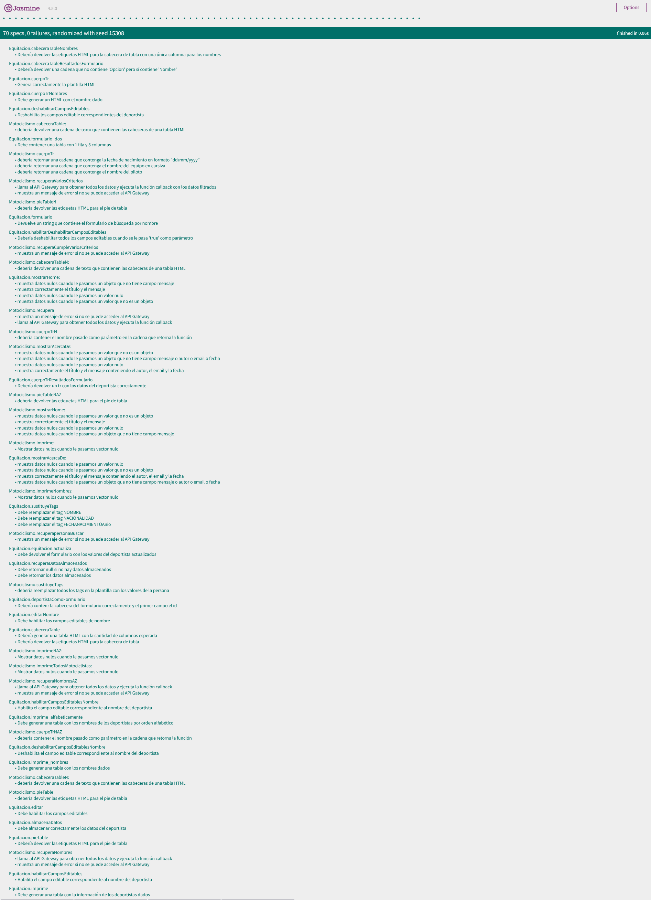

* Trello Tablero: https://trello.com/b/UQcDXxuk/varios-microservicios-api-gateway-front-end
* GitHub: https://github.com/UJA-DAGIL-22-23/d-agil-2022-2023-practica-4-bader_carlos_irene_javier_raul
* Daily Scrum: https://docs.google.com/document/d/1olmXA_z8nd6RmnHquL04fEoVBWBdoe5aGUP_Z9PwRIg/edit

# *Datos Estudiantes*

## Estudiante 1:
Nombre: Bader

Apellidos: Irheem

Correo Electronico: bsi00001@red.ujaen.es

Deporte: Kung-Fu

## Los campos elegidos para realizar la base de datos son:

**-	CAMPOS TIPO NOMBRE:**

**-	CAMPOS TIPO COMPUESTO:**

**-	CAMPOS TIPO VECTOR:**

**-	CAMPOS TIPO NUMÉRICO:**

## Estudiante 2:

Nombre: Carlos

Apellidos: Garvin Rubiales

Correo Electronico: cgr00064@red.ujaen.es

Deporte: Equitación

## Los campos elegidos para realizar la base de datos son:

**-	CAMPOS TIPO NOMBRE:**

**-	CAMPOS TIPO COMPUESTO:**

**-	CAMPOS TIPO VECTOR:**

**-	CAMPOS TIPO NUMÉRICO:**

## Estudiante 3:

Nombre: Irene 

Apellidos: Rubiales Argüelles

Correo Electronico: ira00026@red.ujaen.es

Deporte: Motociclismo

## Los campos elegidos para realizar la base de datos son:

**-	CAMPOS TIPO NOMBRE:**

•	Nombre: El nombre del piloto.

•	Nombre del equipo: Un campo de nombre que indica el nombre del equipo al que pertenece el piloto.

•	Tipo de moto: El modelo de motocicleta que utiliza el piloto en las carreras.

**-	CAMPOS TIPO COMPUESTO:**

•	Fecha de nacimiento del piloto: Compuesto por un campo día, mes y año.

**-	CAMPOS TIPO VECTOR:**

•	Años de experiencia del piloto: Un vector que contiene los años en los que el piloto ha competido en carreras de motociclismo.

•	Puntuaciones en cada carrera: Un campo vector que incluye la puntuación obtenida por el piloto en cada carrera disputada en una 	temporada.

•	Marcas de motocicletas utilizadas: (campo de tipo vector que enumera las marcas de motocicletas que ha utilizado el piloto a lo 	largo de su carrera, por ejemplo: [Honda, Yamaha, Ducati])

**-	CAMPOS TIPO NUMÉRICO:**

•	Posición en el campeonato: Un campo numérico que indica la posición que ocupa el piloto en la clasificación del campeonato.

## Estudiante 4:

Nombre: Javier

Apellidos: Martinez López

Correo Electronico: jml00059@red.ujaen.es

Deporte: Gimnasia

## Los campos elegidos para realizar la base de datos son:

**-	CAMPOS TIPO NOMBRE:**

**-	CAMPOS TIPO COMPUESTO:**

**-	CAMPOS TIPO VECTOR:**

**-	CAMPOS TIPO NUMÉRICO:**

## Estudiante 5:

Nombre: Raúl

Apellidos: Fernandez Cortes

Correo Electronico: rfc00024@red.ujaen.es

Deporte: Parkour

## Los campos elegidos para realizar la base de datos son:

**-	CAMPOS TIPO NOMBRE:**

**-	CAMPOS TIPO COMPUESTO:**

**-	CAMPOS TIPO VECTOR:**

**-	CAMPOS TIPO NUMÉRICO:**

# *Historias de usuario elegidas a implementar en mi aplicación de microservicios:* 
* HU 01.Ofrecer en la aplicación toda la funcionalidad de la práctica individual creada por Bader
* HU 02. Ofrecer en la aplicación toda la funcionalidad de la práctica individual creada por Carlos
* HU 03. Ofrecer en la aplicación toda la funcionalidad de la práctica individual creada por Irene
* HU 04. Ofrecer en la aplicación toda la funcionalidad de la práctica individual creada por Javier
* HU 05. Ofrecer en la aplicación toda la funcionalidad de la práctica individual creada por Raúl
* HU 06. Ver en una sola página la información de todos los autores de la aplicación al pulsar en el botón “Acerca de”
* HU 07. Ver un listado solo con los nombres de todos los jugadores/equipos de todos los deportes incluidos en la app.
* HU 08. Ver un listado solo con los nombres de todos los jugadores/equipos ordenados alfabéticamente de todos los deportes incluidos en la app.
* HU 9. Mostrar el nombre y el deporte de todos los jugadores/equipos que contengan una determinada cadena introducida por el usuario. (Por ejemplo, si el usuario introduce “EST” se mostrarán todos los nombres junto con el deporte practicado de todos los jugadores/equipos cuyo nombre incluya “EST”)

## Captura TRELLO "Historias de usuario":

## HU 01.Ofrecer en la aplicación toda la funcionalidad de la práctica individual creada por Bader

## HU 02. Ofrecer en la aplicación toda la funcionalidad de la práctica individual creada por Carlos

## HU 03: Ofrecer en la aplicación toda la funcionalidad de la práctica individual creada por Irene.
## Capturas TRELLO "HU 03":

* Esta es la captura de mi aplicación de motociclismo en el index, como ejemplo de su correcto funcionamiento, inserto también en la captura la tabla que muestra todos los datos de los jugadores al hacer click en el botón de "Listar datos completos". Aún así, el resto de funcionalidades también se ejecutan correctamente:

## HU 04. Ofrecer en la aplicación toda la funcionalidad de la práctica individual creada por Javier

## HU 05. Ofrecer en la aplicación toda la funcionalidad de la práctica individual creada por Raúl

## HU 06. Ver en una sola página la información de todos los autores de la aplicación al pulsar en el botón “Acerca de”
## Capturas TRELLO "HU 06":

* Esta es la captura para demostrar el correcto funcionamiento de la historia de usuario 6, al hacer click en el botón de "Acerca De", muestra los datos de todos los miembros del grupo, además del microservicio y deporte que han llevado a cabo:

* En la siguiente captura, se muestra la nueva barra de navegación que hemos creado para que aparezcan los botones comunes a todas las aplicaciones integradas en el proyecto: "Home" y "Acerca De":

## HU 07. Ver un listado solo con los nombres de todos los jugadores/equipos de todos los deportes incluidos en la app.

## HU 08. Ver un listado solo con los nombres de todos los jugadores/equipos ordenados alfabéticamente de todos los deportes incluidos en la app.

## HU 9. Mostrar el nombre y el deporte de todos los jugadores/equipos que contengan una determinada cadena introducida por el usuario. (Por ejemplo, si el usuario introduce “EST” se mostrarán todos los nombres junto con el deporte practicado de todos los jugadores/equipos cuyo nombre incluya “EST”)

# *TDDS Y expects*
Aquí inserto la captura de los TDD's de los deportes de : Motociclismo y equitación. Demostrando así, su correcto funcionamiento, adaptación al código e implementación:

