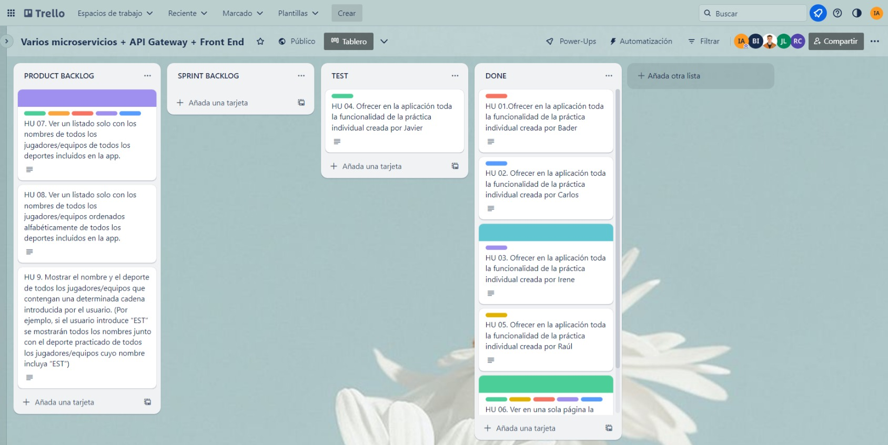
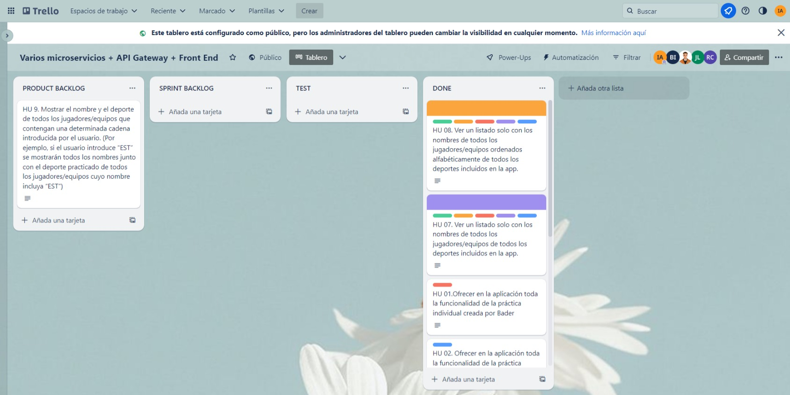

[](https://classroom.github.com/a/hCaQWL7N)
[](https://classroom.github.com/online_ide?assignment_repo_id=10921813&assignment_repo_type=AssignmentRepo)


* Trello Tablero: https://trello.com/b/UQcDXxuk/varios-microservicios-api-gateway-front-end
* GitHub: https://github.com/UJA-DAGIL-22-23/d-agil-2022-2023-practica-4-bader_carlos_irene_javier_raul
* Daily Scrum: https://docs.google.com/document/d/1olmXA_z8nd6RmnHquL04fEoVBWBdoe5aGUP_Z9PwRIg/edit

# *Datos Estudiantes*

## Estudiante 1:
Nombre: Bader

Apellidos: Irheem

Correo Electronico: bsi00001@red.ujaen.es

Deporte: Kung-Fu

## Los campos elegidos para realizar la base de datos son:

**-	CAMPOS TIPO NOMBRE:**

•	color_cinturón: El color del cinturón del jugador

•	nombre_gimnasio: El nombre del gimnasio donde entrena el jugador

**-	CAMPOS TIPO COMPUESTO:**

•	nombre_completo: El nombre completo del jugador (nombre y apellidos)

•	fecha_nacimiento: La fecha de nacimiento del jugador (día, mes y año)

•	dirección: La dircción donde vive el jugador (calle, localidad, provincia y pais)

**-	CAMPOS TIPO VECTOR:**

•	años_participacion_juegos_olimpicos: Los años en el que participó el jugador en los juegos olimpicos

**-	CAMPOS TIPO NUMÉRICO:**

•	numero_particiapciones_Juegos_olimpicos: El número de participaciones en los juegos olimpicos

## Estudiante 2:

Nombre: Carlos

Apellidos: Garvin Rubiales

Correo Electronico: cgr00064@red.ujaen.es

Deporte: Equitación

## Los campos elegidos para realizar la base de datos son:

**-	CAMPOS TIPO NOMBRE:**

•	Nombre: El nombre del jinete.

•	Apellido: El apellido del jinete.

•	Nacionalidad: Nacionalidad del jinete.

**-	CAMPOS TIPO COMPUESTO:**

•	Fecha de nacimiento: La fecha de nacimiento del jinete (día, mes y año)

**-	CAMPOS TIPO VECTOR:**

•	Disciplinas: Diferentes disciplinas en las que compite el jinete.

•	Caballos: Nombre de los caballos que tiene el jinete.

•	Años de participación en juegos olímpicos: Diferentes años en los que el jinete ha participado en los JJOO.

**-	CAMPOS TIPO NUMÉRICO:**

•	Edad: Edad del jinete.

## Estudiante 3:

Nombre: Irene 

Apellidos: Rubiales Argüelles

Correo Electronico: ira00026@red.ujaen.es

Deporte: Motociclismo

## Los campos elegidos para realizar la base de datos son:

**-	CAMPOS TIPO NOMBRE:**

•	Nombre: El nombre del piloto.

•	Nombre del equipo: Un campo de nombre que indica el nombre del equipo al que pertenece el piloto.

•	Tipo de moto: El modelo de motocicleta que utiliza el piloto en las carreras.


**-	CAMPOS TIPO COMPUESTO:**

•	Fecha de nacimiento del piloto: Compuesto por un campo día, mes y año.


**-	CAMPOS TIPO VECTOR:**

•	Años de experiencia del piloto: Un vector que contiene los años en los que el piloto ha competido en carreras de motociclismo.

•	Puntuaciones en cada carrera: Un campo vector que incluye la puntuación obtenida por el piloto en cada carrera disputada en una 	temporada.

•	Marcas de motocicletas utilizadas: (campo de tipo vector que enumera las marcas de motocicletas que ha utilizado el piloto a lo 	largo de su carrera, por ejemplo: [Honda, Yamaha, Ducati])


**-	CAMPOS TIPO NUMÉRICO:**

•	Posición en el campeonato: Un campo numérico que indica la posición que ocupa el piloto en la clasificación del campeonato.


## Estudiante 4:

Nombre: Javier

Apellidos: Martínez López

Correo Electronico: jml00059@red.ujaen.es

Deporte: Gimnasia 

## Los campos elegidos para realizar la base de datos son:

**-	CAMPOS TIPO NOMBRE:**

•	Nombre: El nombre de el/la gimnasta

•	Pais: El pais de el/la gimnasta

•	Modalidad: La modalidad de el/la gimnasta

**-	CAMPOS TIPO COMPUESTO:**

•	Fecha Nacimiento: La fecha de nacimiento de el/la gimnasta en formato día, mes y año

**-	CAMPOS TIPO VECTOR:**

•	AniosJJ00: Los años que ha participado en los JJOO el/la gimnasta

**-	CAMPOS TIPO NUMÉRICO:**

•	Edad: La edad de el/la gimnasta

•	Grupo: El grupo de el/la gimnasta

## Estudiante 5:

Nombre: Raúl

Apellidos: Fernandez Cortes

Correo Electronico: rfc00024@red.ujaen.es

Deporte: Parkour

## Los campos elegidos para realizar la base de datos son:


**-	CAMPOS TIPO NOMBRE:**

•	Nombre: El nombre del participante.

•	Apellidos: Apellidos del participante.


**-	CAMPOS TIPO COMPUESTO:**

•	Fecha de nacimiento: Compuesto por un campo día, mes y año.


**-	CAMPOS TIPO VECTOR:**

•	participaciones_en_competiciones_oficiales: Un vector que contiene los años en los que el piloto ha competido en competiciones oficiales.


**-	CAMPOS TIPO NUMÉRICO:**

•	Participaciones_en_eventos_a_nivel_internacional: Un campo numérico que indica el numero de participaciones internacionales.
• Numero_de_trofeos_conseguidos:Un campo numérico que indica el numero de trofeos conseguidos.


# *Historias de usuario elegidas a implementar en mi aplicación de microservicios:* 
* HU 01.Ofrecer en la aplicación toda la funcionalidad de la práctica individual creada por Bader
* HU 02. Ofrecer en la aplicación toda la funcionalidad de la práctica individual creada por Carlos
* HU 03. Ofrecer en la aplicación toda la funcionalidad de la práctica individual creada por Irene
* HU 04. Ofrecer en la aplicación toda la funcionalidad de la práctica individual creada por Javier
* HU 05. Ofrecer en la aplicación toda la funcionalidad de la práctica individual creada por Raúl
* HU 06. Ver en una sola página la información de todos los autores de la aplicación al pulsar en el botón “Acerca de”
* HU 07. Ver un listado solo con los nombres de todos los jugadores/equipos de todos los deportes incluidos en la app.
* HU 08. Ver un listado solo con los nombres de todos los jugadores/equipos ordenados alfabéticamente de todos los deportes incluidos en la app.
* HU 9. Mostrar el nombre y el deporte de todos los jugadores/equipos que contengan una determinada cadena introducida por el usuario. (Por ejemplo, si el usuario introduce “EST” se mostrarán todos los nombres junto con el deporte practicado de todos los jugadores/equipos cuyo nombre incluya “EST”)

## Captura TRELLO "Historias de usuario":


## HU 01.Ofrecer en la aplicación toda la funcionalidad de la práctica individual creada por Bader
## Captura TRELLO "HU 01":


* Esta es la captura de mi aplicación de motociclismo en el index, como ejemplo de su correcto funcionamiento, inserto también en la captura la tabla que muestra todos los datos de los jugadores al hacer click en el botón de "Listar datos completos". Aún así, el resto de funcionalidades también se ejecutan correctamente:


## HU 02. Ofrecer en la aplicación toda la funcionalidad de la práctica individual creada por Carlos


## HU 03: Ofrecer en la aplicación toda la funcionalidad de la práctica individual creada por Irene.
## Capturas TRELLO "HU 03":


* Esta es la captura de mi aplicación de kungfu en el index, como ejemplo de su correcto funcionamiento, busco el nombre de un jugador y al hacer click en el botón de "Buscar por nombre" aparecen los datos completos de el jugador buscado. Aún así, el resto de funcionalidades también se ejecutan correctamente:


## HU 04. Ofrecer en la aplicación toda la funcionalidad de la práctica individual creada por Javier


## HU 05. Ofrecer en la aplicación toda la funcionalidad de la práctica individual creada por Raúl


* Barra de navegacion parkour.


* Esta es la captura de mi aplicación de parkour en el index, como ejemplo de su correcto funcionamiento, inserto también en la captura la tabla que muestra todos los datos de los jugadores al hacer click en el botón de "Listar todos los datos". Aún así, el resto de funcionalidades también se ejecutan correctamente:


* Posteriormente he procedido a organizar mis funciones en el index en una tabla del color de su HU asignada en trello para su mejoría en la visualización:


## HU 06. Ver en una sola página la información de todos los autores de la aplicación al pulsar en el botón “Acerca de”
## Capturas TRELLO "HU 06":


* Esta es la captura para demostrar el correcto funcionamiento de la historia de usuario 6, al hacer click en el botón de "Acerca De", muestra los datos de todos los miembros del grupo, además del microservicio y deporte que han llevado a cabo:


* En la siguiente captura, se muestra la nueva barra de navegación que hemos creado para que aparezcan los botones comunes a todas las aplicaciones integradas en el proyecto: "Home" y "Acerca De":


## HU 07. Ver un listado solo con los nombres de todos los jugadores/equipos de todos los deportes incluidos en la app.
* Para esta historia de usuario, hemos trabajado en ramas (RAMA: HU7), para intentar generar el menor número de conflictos posibles y agilizar el trabajo como equipo.
* El objetivo de dicha historia de usuario es conseguir visualizar todos los nombres de cada uno de los deportes integrados en la aplicación de manera conjunta en una misma tabla.




* Hemos realizado estos métodos en el fichero ms-kung-fu, utilizando las funciones:

* plantillaTags(), sustituyeTags(), actualiza(), recupera() e imprime(). Con sus correspondientes y nuevas denominaciones:

* plantillaTags() y sustituyeTags(), incluyen en la denominación el nombre de cada deporte al que corresponde su función.
```
//plantillaTags
//KUNGFU
KungFu.KungFuTags = {
    "ID": "### ID ###",
    "NOMBRE_COMPLETO": "### NOMBRE_COMPLETO ###",
    "NOMBRE": "### NOMBRE ###",
    "APELLIDOS": "### APELLIDS ###",
    "FECHA_NACIMIENTO": "### FECHA DE NACIMIENTO ###",
    "DIRECCION": "### DIRECCION ###",
    "NUMERO_PARTICIPACIONES": "### NUMERO PARTICIPACIONES ###",
    "AÑOS PARTICIPACION": "### AÑOS PARTICIPACION ###",
    "COLOR_CINTURON": "### COLOR_CINTURON ###",
    "NOMBRE_GIMNASIO": "### NOMBRE DEL GIMNASIO ###"
}
//EQUITACION
KungFu.equitacionTags = {
    ID: "### ID ###",
    NOMBRE: "### NOMBRE ###",
    APELLIDO: "### APELLIDO ###",
    FECHANACIMIENTODia: "### FECHA DE NACIMIENTO Día ###",
    FECHANACIMIENTOMes: "### FECHA DE NACIMIENTO Mes ###",
    FECHANACIMIENTOAnio: "### FECHA DE NACIMIENTO Anio ###",
    NACIONALIDAD: "### NACIONALIDAD ###",
    EDAD: "### EDAD ###",
    DISCIPLINAS: "### DISCIPLINAS ###",
    CABALLOS: "### CABALLOS ###",
    ANIOSPARTICPACIONJJOO: "### AÑOS DE PARTICIPACION EN LOS JJOO ###"
}

//MOTOCICLISMO
KungFu.motociclismoTags = {
    "NOMBRE": "### NOMBRE ###",
    "NOMBRE_EQUIPO": "### NOMBRE_EQUIPO ###",
    "TIPO_MOTO": "### TIPO_MOTO ###",
    "FECHA_NACIMIENTO": "### FECHA_NACIMIENTO ###",
    "ANIOS_EXPERIENCIA": "### ANIOS_EXPERIENCIA ###",
    "PUNTUACIONES_CARRERA": "### PUNTUACIONES_CARRERA ###",
    "MARCAS_MOTOCICLETAS": "### MARCAS_MOTOCICLETAS ###",
    "POSICION_CAMPEONATO": "### POSICION_CAMPEONATO ###",
}

//PARKOUR
KungFu.ParkourTags = {
    "ID": "### ID ###",
    "NOMBRE": "### NOMBRE ###",
    "APELLIDOS": "### APELLIDOS ###",
    "COMPETICIONES_OFICIALES": "### COMPETICIONES_OFICIALES ###",
    "PARTICIPACIONES_INTERNACIONALES": "### PARTICIPACIONES_INTERNACIONALES ###",
    "TROFEOS_CONSEGUIDOS": "### TROFEOS_CONSEGUIDOS ###",
}

//GIMNASIA
KungFu.gimnasiaTags = { //hecho el TDD
    "ID": "### ID ###",
    "NOMBRE": "### NOMBRE ###",
    "PAIS": "### PAIS ###",
    "EDAD": "### EDAD ###",
    "MODALIDAD": "### MODALIDAD ###",
    "GRUPO": "### GRUPO ###",
    "AniosJJOO": "### AniosJJOO ###",
}
```
```
//sustituyeTags

KungFu.sustituyeTags = function (kungfu, jugador) {
    return kungfu
        .replace(new RegExp(KungFu.KungFuTags.ID, 'g'), jugador.ref['@ref'].id)
        .replace(new RegExp(KungFu.KungFuTags.NOMBRE, 'g'), jugador.data.nombre_completo.nombre)
        .replace(new RegExp(KungFu.KungFuTags.APELLIDOS, 'g'), jugador.data.nombre_completo.apellidos)
        .replace(new RegExp(KungFu.KungFuTags.FECHA_NACIMIENTO, 'g'), jugador.data.fecha_nacimiento.dia + "/" + jugador.data.fecha_nacimiento.mes + "/" + jugador.data.fecha_nacimiento.año)
        .replace(new RegExp(KungFu.KungFuTags.DIRECCION, 'g'), jugador.data.direccion.calle + ", " + jugador.data.direccion.localidad + ", " + jugador.data.direccion.provincia + ", " + jugador.data.direccion.pais)
        .replace(new RegExp(KungFu.KungFuTags.NUMERO_PARTICIPACIONES, 'g'), jugador.data.numero_particiapciones_Juegos_olimpicos)
        .replace(new RegExp(KungFu.KungFuTags["AÑOS PARTICIPACION"], 'g'), jugador.data.años_participacion_juegos_olimpicos)
        .replace(new RegExp(KungFu.KungFuTags.COLOR_CINTURON, 'g'), jugador.data.color_cinturon)
        .replace(new RegExp(KungFu.KungFuTags.NOMBRE_GIMNASIO, 'g'), jugador.data.nombre_gimnasio)
}
KungFu.sustituyeTagsEquitacion = function (equitacion, deportista) {
    return equitacion
         .replace(new RegExp(KungFu.equitacionTags.ID, 'g'), deportista.ref['@ref'].id)
         .replace(new RegExp(KungFu.equitacionTags.NOMBRE, 'g'), deportista.data.nombre)
         .replace(new RegExp(KungFu.equitacionTags.APELLIDO, 'g'), deportista.data.apellido)
         .replace(new RegExp(KungFu.equitacionTags.FECHANACIMIENTODia, 'g'), deportista.data.fechaNacimiento.dia)
         .replace(new RegExp(KungFu.equitacionTags.FECHANACIMIENTOMes, 'g'), deportista.data.fechaNacimiento.mes)
         .replace(new RegExp(KungFu.equitacionTags.FECHANACIMIENTOAnio, 'g'), deportista.data.fechaNacimiento.anio)
         .replace(new RegExp(KungFu.equitacionTags.NACIONALIDAD, 'g'), deportista.data.nacionalidad)
         .replace(new RegExp(KungFu.equitacionTags.EDAD, 'g'), deportista.data.edad)
         .replace(new RegExp(KungFu.equitacionTags.DISCIPLINAS, 'g'), deportista.data.disciplinas)
         .replace(new RegExp(KungFu.equitacionTags.CABALLOS, 'g'), deportista.data.caballos)
         .replace(new RegExp(KungFu.equitacionTags.ANIOSPARTICPACIONJJOO, 'g'), deportista.data.aniosParticipacionJJOO)
}
KungFu.sustituyeTagsMotociclismo = function (motociclismo, persona) {
    return motociclismo
        .replace(new RegExp(KungFu.motociclismoTags.NOMBRE, 'g'), persona.data.nombre)
        .replace(new RegExp(KungFu.motociclismoTags.NOMBRE_EQUIPO, 'g'), persona.data.nombre_equipo)
        .replace(new RegExp(KungFu.motociclismoTags.TIPO_MOTO, 'g'), persona.data.tipo_moto)
        .replace(new RegExp(KungFu.motociclismoTags["FECHA_NACIMIENTO"], 'g'),  persona.data.fecha_nacimiento.dia + "/" + persona.data.fecha_nacimiento.mes + "/" + persona.data.fecha_nacimiento.anio)
        .replace(new RegExp(KungFu.motociclismoTags["ANIOS_EXPERIENCIA"], 'g'), persona.data.anios_experiencia.join( ", "))
        .replace(new RegExp(KungFu.motociclismoTags["PUNTUACIONES_CARRERA"], 'g'), persona.data.puntuaciones_carrera.join( ", "))
        .replace(new RegExp(KungFu.motociclismoTags["MARCAS_MOTOCICLETAS"], 'g'), persona.data.marcas_motocicletas.join( ", "))
        .replace(new RegExp(KungFu.motociclismoTags.POSICION_CAMPEONATO, 'g'), persona.data.posicion_campeonato)
        
}

KungFu.sustituyeTagsParkour = function (Parkour, persona) {
    return Parkour
        .replace(new RegExp(KungFu.ParkourTags.ID, 'g'), persona.ref['@ref'].id)
        .replace(new RegExp(KungFu.ParkourTags.NOMBRE, 'g'), persona.data.nombre)
        .replace(new RegExp(KungFu.ParkourTags.APELLIDOS, 'g'), persona.data.apellidos)
        .replace(new RegExp(KungFu.ParkourTags.COMPETICIONES_OFICIALES, 'g'), persona.data.participaciones_en_competiciones_oficiales)
        .replace(new RegExp(KungFu.ParkourTags.PARTICIPACIONES_INTERNACIONALES, 'g'), persona.data.Participaciones_en_eventos_a_nivel_internacional)
        .replace(new RegExp(KungFu.ParkourTags.TROFEOS_CONSEGUIDOS, 'g'), persona.data.numero_de_trofeos_conseguidos)   
}

KungFu.sustituyeTagsGimnasia = function (gimnasia, persona) {   //hecho el TDD
    return gimnasia
    .replace(new RegExp(KungFu.gimnasiaTags.ID, 'g'), persona.ref['@ref'].id)
    .replace(new RegExp(KungFu.gimnasiaTags.NOMBRE, 'g'), persona.data.nombre)
    .replace(new RegExp(KungFu.gimnasiaTags.PAIS, 'g'), persona.data.pais)
    .replace(new RegExp(KungFu.gimnasiaTags.EDAD, 'g'), persona.data.edad)
    .replace(new RegExp(KungFu.gimnasiaTags.MODALIDAD, 'g'), persona.data.modalidad)
    .replace(new RegExp(KungFu.gimnasiaTags.GRUPO, 'g'), persona.data.grupo)
    .replace(new RegExp(KungFu.gimnasiaTags.AniosJJOO, 'g'), persona.data.aniosJJOO)
}

```

* actualiza() es actualizaNombres + denominación de cada uno de los deportes()
```
KungFu.KungFuTablaJugadores.actualizaNombresKungfu = function (jugador) {
    return KungFu.sustituyeTags(this.cuerpoNombresTodos, jugador)
}

KungFu.KungFuTablaJugadores.actualizaNombresEquitacion = function (jugador) {
    return KungFu.sustituyeTagsEquitacion(this.cuerpoNombresTodos, jugador)
}

KungFu.KungFuTablaJugadores.actualizaNombresMotociclismo = function (jugador) {
    return KungFu.sustituyeTagsMotociclismo(this.cuerpoNombresTodos, jugador)
}

KungFu.KungFuTablaJugadores.actualizaNombresParkour = function (jugador) {
    return KungFu.sustituyeTagsParkour(this.cuerpoNombresTodos, jugador)
}
KungFu.KungFuTablaJugadores.actualizaNombresGimnasia = function (jugador) {
    return KungFu.sustituyeTagsGimnasia(this.cuerpoNombresTodos, jugador)
}
```

* recupera() es recuperaJugadoresCompleto()

```
KungFu.recuperaJugadoresCompleto = async function (callBackFn) {
   
    let response_kungfu = null
    let response_equitacion = null
    let response_motociclismo = null
    let response_parkour = null
    let response_gimnasia = null

    // Intento conectar el microservicio KungFu
    try {
        const url_kungfu = Frontend.API_GATEWAY + "/kungfu/getTodos"
        const url_equitacion = Frontend.API_GATEWAY + "/equitacion/getTodosInfo"
        const url_motociclismo = Frontend.API_GATEWAY + "/motociclismo/getTodos"
        const url_parkour = Frontend.API_GATEWAY + "/parkour/getTodas"
        const url_gimnasia = Frontend.API_GATEWAY + "/gimnasia/getTodas"

        response_kungfu = await fetch(url_kungfu)
        response_equitacion = await fetch(url_equitacion)
        response_motociclismo = await fetch(url_motociclismo)
        response_parkour = await fetch(url_parkour)
        response_gimnasia = await fetch(url_gimnasia)

    } catch (error) {
        alert("Error: No se han podido acceder al API Geteway")
        console.error(error)
    }

    //mostrar todos los jugadores que se han descargado
    let vectorJugadores_kungfu = null
    let vectorJugadores_equitacion = null
    let vectorJugadores_motociclismo = null
    let vectorJugadores_parkour = null
    let vectorJugadores_gimnasia = null

    if (response_kungfu && response_equitacion && response_motociclismo && response_parkour&& response_gimnasia) {
        vectorJugadores_kungfu = await response_kungfu.json()
        vectorJugadores_equitacion = await response_equitacion.json()
        vectorJugadores_motociclismo = await response_motociclismo.json()
        vectorJugadores_parkour = await response_parkour.json()
        vectorJugadores_gimnasia = await response_gimnasia.json()
        
        callBackFn(vectorJugadores_kungfu.data, vectorJugadores_equitacion.data, vectorJugadores_motociclismo.data, vectorJugadores_parkour.data, vectorJugadores_gimnasia.data)
    }
}

```

*imprime() es imprimeTodosJugadores()

```
KungFu.imprimeTodos = function (vectorJugadores_kungfu, vectorJugadores_equitacion, vectorJugadores_motociclismo, vectorJugadores_parkour, vectorJugadores_gimnasia) {
    
    // Compongo el contenido que se va a mostrar dentro de la tabla
    let msj = KungFu.KungFuTablaJugadores.cabeceraNombresTodos

    if (Array.isArray(vectorJugadores_kungfu) && Array.isArray(vectorJugadores_equitacion) && Array.isArray(vectorJugadores_motociclismo) && Array.isArray(vectorJugadores_parkour ) && Array.isArray(vectorJugadores_gimnasia)) {
        vectorJugadores_kungfu.forEach(e => msj += KungFu.KungFuTablaJugadores.actualizaNombresKungfu(e));
        vectorJugadores_equitacion.forEach(e => msj += KungFu.KungFuTablaJugadores.actualizaNombresEquitacion(e));
        vectorJugadores_motociclismo.forEach(e => msj += KungFu.KungFuTablaJugadores.actualizaNombresMotociclismo(e));
        vectorJugadores_parkour.forEach(e => msj += KungFu.KungFuTablaJugadores.actualizaNombresParkour(e));
        vectorJugadores_gimnasia.forEach(e => msj += KungFu.KungFuTablaJugadores.actualizaNombresGimnasia(e));
    }
    msj += KungFu.KungFuTablaJugadores.pie

    // Borrar toda la información del Article y la sustituyo por la que ma interesa
    Frontend.Article.actualizar("Listado de los nombres de todos los jugadores de todos los deportes", msj)
}
```
* PRUEBA DE QUE FUNCIONA LA HU7: 


* Además para esta nueva funcionalidad, hemos añadido un botón en el index en al barra de navegación general de la aplicación: 

## HU 08. Ver un listado solo con los nombres de todos los jugadores/equipos ordenados alfabéticamente de todos los deportes incluidos en la app.
* Para esta historia de usuario, hemos trabajado en varias ramas, para intentar cada uno por separado la implementación de esta historia de usuario, hasta conseguir la funcionalidad deseada, también nos hemos reunido algunos miembros del grupo y hemos trabajado en una misma rama.




* El objetivo de dicha historia de usuario es conseguir visualizar todos los nombres de cada uno de los deportes integrados en la aplicación de manera conjunta en una misma tabla Y MOSTRARLOS POR ORDEN ALFABÉTICO.
* Para ello, hemos concatenado(concat) los datos de vectores de cada uno de los deportes a un vector,además, se ordena el vector al que se han concatenado:

´´´
KungFu.imprimeTodosOrdenados = function (vectorJugadores_kungfu, vectorJugadores_equitacion, vectorJugadores_motociclismo, vectorJugadores_parkour, vectorJugadores_gimnasia) {
    
    // Componemos el contenido que se va a mostrar dentro de la tabla
    let msj = KungFu.KungFuTablaJugadores.cabeceraNombresTodos;

    if (Array.isArray(vectorJugadores_kungfu) && Array.isArray(vectorJugadores_equitacion) && Array.isArray(vectorJugadores_motociclismo) && Array.isArray(vectorJugadores_parkour) && Array.isArray(vectorJugadores_gimnasia)) {
        // Unimos todos los vectores en uno solo
        const todosLosJugadores = [
            ...vectorJugadores_kungfu.map(jugador => jugador.data.nombre_completo.nombre),
            ...vectorJugadores_equitacion.map(jugador => jugador.data.nombre),
            ...vectorJugadores_motociclismo.map(jugador => jugador.data.nombre),
            ...vectorJugadores_parkour.map(jugador => jugador.data.nombre),
            ...vectorJugadores_gimnasia.map(jugador => jugador.data.nombre)
        ];

        // Ordenamos alfabéticamente el array de nombres de jugadores
        todosLosJugadores.sort((a, b) => a.localeCompare(b));

        // Agregamos los nombres de los jugadores ordenados al mensaje
        todosLosJugadores.forEach(nombreJugador => {
            msj += `<tr><td>${nombreJugador}</td></tr>`;
        });
    }
    
    msj += KungFu.KungFuTablaJugadores.pie;

    // Borramos toda la información del Article y la sustituimos por la que nos interesa
    Frontend.Article.actualizar("Listado de los nombres de todos los jugadores de todos los deportes ordenados alfabeticamente", msj);
}

´´´
* Esta función toma cinco vectores de jugadores correspondientes a diferentes deportes: Kung Fu, equitación, motociclismo, parkour y gimnasia.

La función comienza comprobando si todos los parámetros que se han pasado son de tipo array. Si todos son arrays, entonces todos los jugadores se combinan en un único array llamado "todosLosJugadores" mediante el uso de "spread" y el método "map". A continuación, se ordena alfabéticamente el array "todosLosJugadores" usando el método "sort" y se agregan los nombres de los jugadores ordenados al mensaje msj utilizando el método forEach.

* PRUEBA DE QUE FUNCIONA LA HU7: 


* Además para esta nueva funcionalidad, hemos añadido un botón en el index en al barra de navegación general de la aplicación: 


## HU 9. Mostrar el nombre y el deporte de todos los jugadores/equipos que contengan una determinada cadena introducida por el usuario. (Por ejemplo, si el usuario introduce “EST” se mostrarán todos los nombres junto con el deporte practicado de todos los jugadores/equipos cuyo nombre incluya “EST”)

# *TDDS Y expects*
Aquí insertamos las capturas de los TDD's de los deportes. Demostrando así, su correcto funcionamiento, adaptación al código e implementación:


## TDD de la HU1:

## TDD de la HU2:

## TDD de la HU3:

## TDD de la HU4:

## TDD de la HU5:

## TDD de la HU6:

## TDD de la HU7:


## TDD de la HU8:


## TDD de la HU9:
